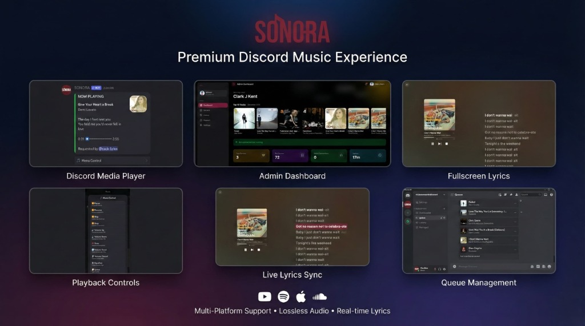

<div align="center">

# 🎵 SONORA

### Premium Discord Music Experience



[](https://github.com/muhammadzakizn/SONORA-Discord-Music-Bot/releases)
[](https://python.org)
[](LICENSE)
[](https://sonora.muhammadzakizn.com)

**Multi-Platform Support • Lossless Audio • Real-time Lyrics**

[Website](https://sonora.muhammadzakizn.com) • [Invite Bot](https://discord.com/oauth2/authorize?client_id=1443855259536461928) • [Support](https://sonora.muhammadzakizn.com/support)

</div>

---

## ✨ Features

### 🎧 Hi-Res Audio Quality
- **512kbps encoder bitrate** - Maximum Discord quality
- Apple Music Lossless-like streaming
- FLAC source support via MusicDL
- Adaptive buffer based on network speed

### 🎤 Real-Time Synced Lyrics
- **Apple Music TTML** with per-word timing
- Fullscreen lyrics player with WebGL animations
- Multiple sources: Syncedlyrics, LRCLib, Musixmatch, Genius
- Custom Lyricify API integration (QQ Music)

### 🎵 Multi-Platform Support
| Platform | Playlists | Albums | Tracks | Search |
|----------|:---------:|:------:|:------:|:------:|
| Spotify | ✅ | ✅ | ✅ | ✅ |
| YouTube Music | ✅ | ✅ | ✅ | ✅ |
| Apple Music | ✅ | ✅ | ✅ | ✅ |
| SoundCloud | ✅ | - | ✅ | ✅ |

### 🌐 Modern Web Dashboard
- **Next.js 14** with Liquid Glass UI design
- Real-time playback status & controls
- **Seekback** - Apple Music Replay-style listening history
- Admin panel for server management
- User statistics & play history

### 🧠 AI-Powered Support
- `/support` command with AI assistant
- Powered by Groq, DeepSeek, or Gemini
- 24/7 automated help & feedback handling

### ⚡ Performance Features
- Smart audio caching (local + cloud FTP)
- Pre-fetch next tracks in queue
- IPv6 support for bypass rate limiting
- Robust voice connection with auto-reconnect

---

## 🚀 Quick Start

### Prerequisites
- Python 3.11+
- FFmpeg
- Node.js 18+ (for web dashboard)

### Installation

```bash
# Clone repository
git clone https://github.com/muhammadzakizn/SONORA-Discord-Music-Bot.git
cd SONORA-Discord-Music-Bot

# Install dependencies
pip install -r requirements.txt

# Configure environment
cp .env.example .env
# Edit .env with your tokens

# Run bot
python launcher.py
```

### Web Dashboard

```bash
cd web
npm install
npm run dev
```

---

## 📋 Commands

| Command | Description |
|---------|-------------|
| `/play <query>` | Play music from any platform |
| `/pause` | Pause playback |
| `/resume` | Resume playback |
| `/skip` | Skip current track |
| `/stop` | Stop and disconnect |
| `/queue` | View queue |
| `/shuffle` | Shuffle queue |
| `/lyrics` | Show synced lyrics |
| `/volume <0-200>` | Adjust volume |
| `/stats` | Your listening statistics |
| `/support` | AI-powered help |

---

## 🛠️ Tech Stack

```
Backend     Python 3.11 | discord.py | yt-dlp | FFmpeg | Flask
Frontend    Next.js 14 | TypeScript | Tailwind CSS | Framer Motion
Database    SQLite | AsyncIO | Aiohttp
Lyrics      Apple Music | Lyricify | LRCLib | Syncedlyrics
Audio       Opus 512kbps | FLAC | AAC | Adaptive Streaming
```

---

## 📁 Project Structure

```
SONORA/
├── main.py              # Entry point
├── launcher.py          # Smart launcher with menu
├── commands/            # Slash commands
├── services/            # Audio, lyrics, metadata services
│   ├── audio/           # YouTube, Spotify, Apple Music handlers
│   ├── lyrics/          # Multi-source lyrics fetchers
│   └── voice/           # Voice connection management
├── web/                 # Next.js web dashboard
├── ui/                  # Discord UI components
├── database/            # SQLite models & managers
└── docs/                # Documentation & changelogs
```

---

## 🔧 Configuration

Key environment variables in `.env`:

```bash
# Required
DISCORD_TOKEN=your_discord_bot_token

# Music Sources
SPOTIFY_CLIENT_ID=your_spotify_client_id
SPOTIFY_CLIENT_SECRET=your_spotify_client_secret

# Optional
GENIUS_API_TOKEN=your_genius_token
GROQ_API_KEY=your_groq_key_for_ai_support
```

See [.env.example](.env.example) for all options.

---

## 📊 Stats

- **75+ Tests** passing
- **200+ Files** organized
- **3.32.0** current version
- Active development since 2024

---

## 🤝 Contributing

Contributions are welcome! Please feel free to submit a Pull Request.

1. Fork the repository
2. Create your feature branch (`git checkout -b feature/amazing`)
3. Commit your changes (`git commit -m 'Add amazing feature'`)
4. Push to the branch (`git push origin feature/amazing`)
5. Open a Pull Request

---

## 📄 License

This project is licensed under the MIT License - see the [LICENSE](LICENSE) file for details.

---

<div align="center">

### 🌟 Star this repo if you find it useful!

**Made with ❤️ by [Muhammad Zaky](https://muhammadzakizn.com)**

[Website](https://sonora.muhammadzakizn.com) • [Portfolio](https://muhammadzakizn.com) • [Support](https://teer.id/muhammadzakizn)

</div>
